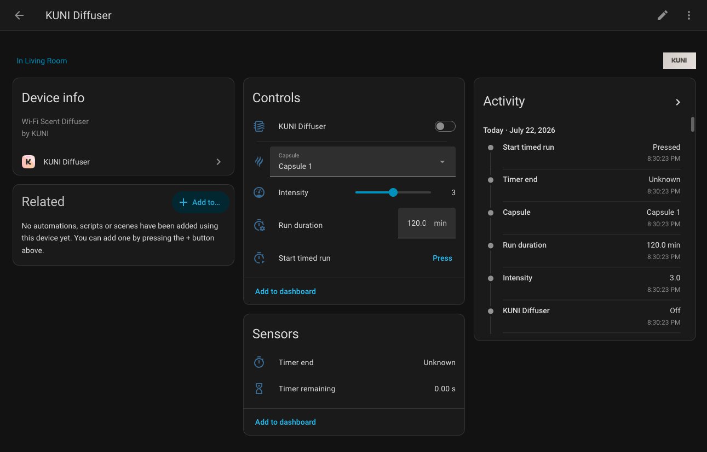

# KUNI Diffuser for Home Assistant

A custom Home Assistant integration for controlling a **KUNI Wi-Fi Scent Diffuser** through the KUNI cloud API.

The integration provides native Home Assistant entities for power, capsule selection, intensity control, timed runs, and timer status.

---

## Features

- Turn the diffuser on and off
- Select one of three capsule positions
- Set diffuser intensity from `0` to `6`
- Configure a timed run from `1` to `1440` minutes
- Start a timed run from Home Assistant
- View the timer end time
- View the remaining timer duration
- Automatic access-token renewal using the configured refresh token
- Reauthentication flow when authentication expires
- UI-based setup through Home Assistant Config Flow
- State updates every 30 seconds
- No YAML configuration required

---

## Entities

| Platform | Entity | Description |
|---|---|---|
| Switch | KUNI Diffuser | Turns the diffuser on or off |
| Select | Capsule | Selects Capsule 1, Capsule 2, or Capsule 3 |
| Number | Intensity | Sets the diffuser intensity from 0 to 6 |
| Number | Run duration | Sets the duration used for timed runs |
| Button | Start timed run | Starts the diffuser for the selected duration |
| Sensor | Timer end | Shows when the active timer will end |
| Sensor | Timer remaining | Shows the remaining timer duration in seconds |

---

## Requirements

Before installing the integration, make sure you have:

- Home Assistant
- HACS
- A KUNI diffuser configured in the official KUNI mobile app
- The required KUNI account and device credentials

---

## Installation

Add the integration through HACS and then configure it from Home Assistant.

➡️ **[Installation Guide](docs/installation/INSTALLATION.md)**

---

## Credentials Setup

The integration requires the following values:

- Client ID
- Refresh Token
- Organization ID
- Device ID

Follow the credential extraction guide:

➡️ **[KUNI Credentials Setup](docs/installation/KUNI_CREDENTIALS_SETUP.md)**

---

## How Timed Runs Work

Set the desired duration using the **Run duration** entity, then press **Start timed run**.

The selected duration is stored locally in Home Assistant and is sent to the diffuser when the button is pressed.

---

## Troubleshooting

If Home Assistant reports an authentication error, the integration will request a new refresh token through its reauthentication flow.

Follow the credential guide again to retrieve an updated token:

➡️ **[KUNI Credentials Setup](docs/installation/KUNI_CREDENTIALS_SETUP.md)**

---

## Contributing

Bug reports, feature requests, and pull requests are welcome.

When reporting a problem, include:

- Your Home Assistant version
- The integration version
- Relevant Home Assistant logs
- The behavior you expected
- The behavior you experienced

Do not include refresh tokens or other private credentials in issues or logs.

---

## Disclaimer

This is an independent community project.

It is not affiliated with, maintained by, or endorsed by KUNI.

---

## License

This project is licensed under the MIT License.
