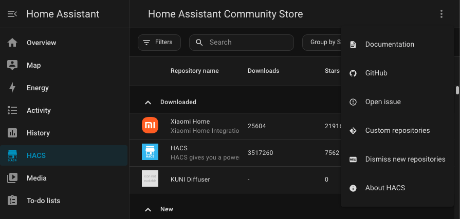
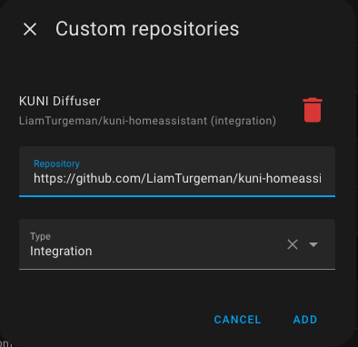
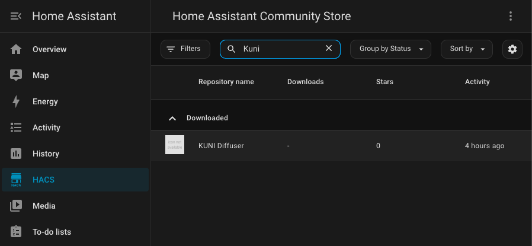
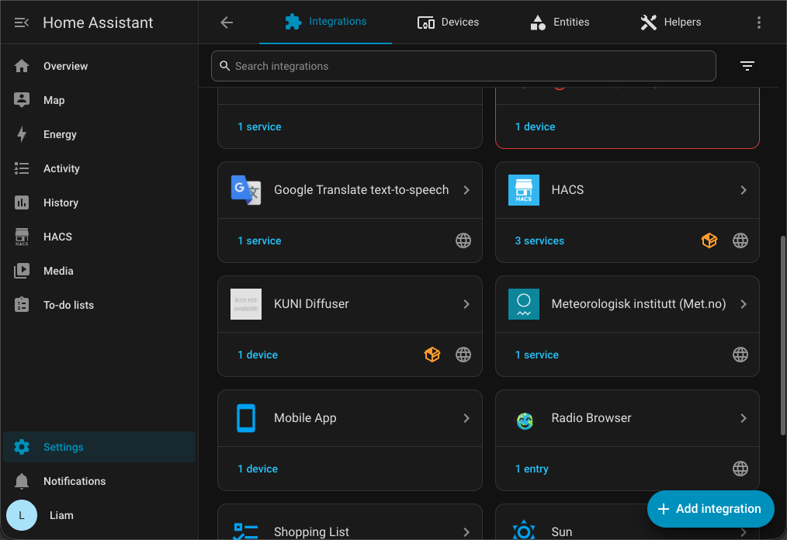
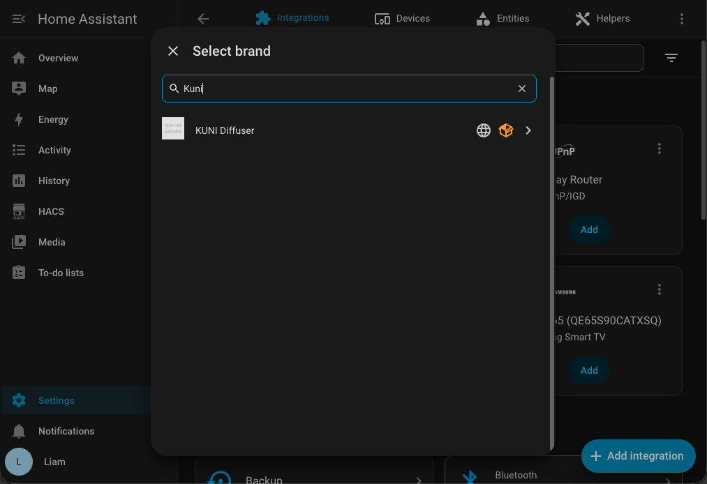

# KUNI Installation

This guide explains how to install the KUNI Diffuser integration into Home Assistant using HACS.

The installation takes approximately **2–3 minutes**.

> [!NOTE]
> This guide only covers installing the integration.
>
> After installation, continue with the **KUNI Credentials Setup** guide to connect your diffuser.

---

## Requirements

Before you begin, make sure you have:

- Home Assistant installed and running.
- HACS (Home Assistant Community Store) installed.
- Internet access from your Home Assistant instance.

---

## Add the Custom Repository

Open **HACS**.

Click the **⋮** menu in the top-right corner.

Select **Custom repositories**.



---

Paste the following repository URL:

```text
https://github.com/LiamTurgeman/kuni-homeassistant
```

Set the repository type to:

```text
Integration
```

Click **Add**.



---

## Verify the Repository

Return to the HACS search page.

Search for:

```text
KUNI
```

You should now see **KUNI Diffuser** in the results.



> [!TIP]
> If the integration does not appear, refresh HACS or restart Home Assistant and try searching again.

---

## Add the Integration

Open:

```text
Settings
→ Devices & Services
```

Click **Add Integration**.



Search for:

```text
KUNI
```

Select **KUNI Diffuser**.



---

## Next Step

The integration requires credentials generated by the official KUNI mobile application.

Continue with:

➡️ **[KUNI Credentials Setup](KUNI_CREDENTIALS_SETUP.md)**
