# KUNI Credentials Setup

This guide explains how to retrieve the credentials required to connect your KUNI diffuser to Home Assistant.

The process takes approximately **5–10 minutes** and only needs to be completed once during the initial setup.

---

## Overview

The KUNI integration requires four credentials:

- Client ID
- Refresh Token
- Organization ID
- Device ID

These credentials are generated by the official KUNI mobile application during the authentication process.

This guide explains how to capture them using **HTTP Toolkit**.

---

## Requirements

Before you begin, make sure you have:

- A KUNI diffuser already paired with your KUNI account.
- The official KUNI mobile app installed on your iPhone.
- A computer running macOS, Windows, or Linux.
- Your computer and iPhone connected to the same Wi-Fi network.
- HTTP Toolkit installed on your computer.

---

## Before You Begin

This guide intercepts the network traffic generated by the official KUNI mobile application.

No modifications are made to your KUNI account or diffuser.

After completing the setup, you can remove the proxy configuration from your phone if you no longer need it.

---

## Estimated Time

**5–10 minutes**

---

## Difficulty

⭐ Beginner

---

# Install HTTP Toolkit

Download and install the latest version of **HTTP Toolkit** from the official website:

https://httptoolkit.com


Launch the application.

When the application opens:

1. Select **Intercept** from the left sidebar.
2. Click **Anything**.

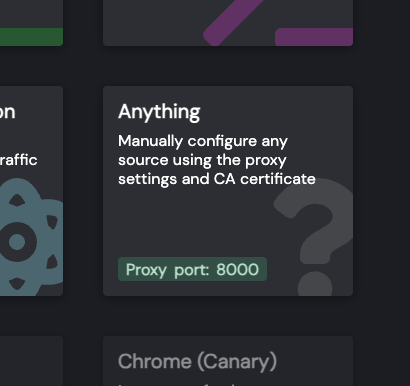

You should now see your computer's local IP address together with the proxy port.

> [!TIP]
> Leave HTTP Toolkit running throughout the entire setup process.

---

# Configure Your iPhone

Using the information displayed in HTTP Toolkit, configure your iPhone to use the proxy.

Open:

```text
Settings
→ Wi-Fi
→ ⓘ Your Wi-Fi Network
```

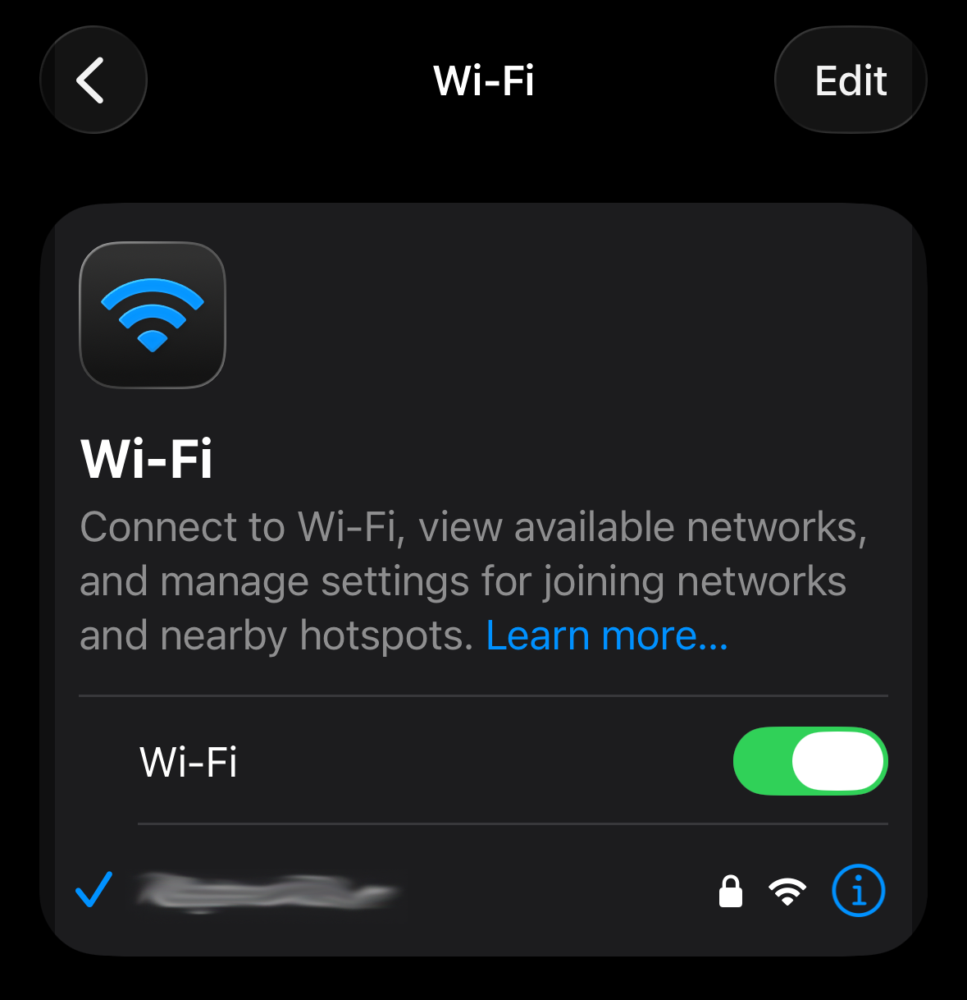

Tap **Configure Proxy** and select **Manual**.

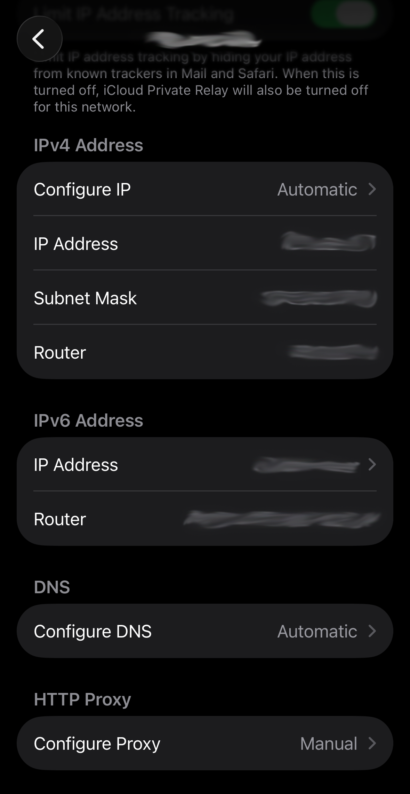

Configure the following values:

**Server**

```text
<Your Computer IP Address>
```

**Port**

```text
8000
```

**Authentication**

```text
Off
```

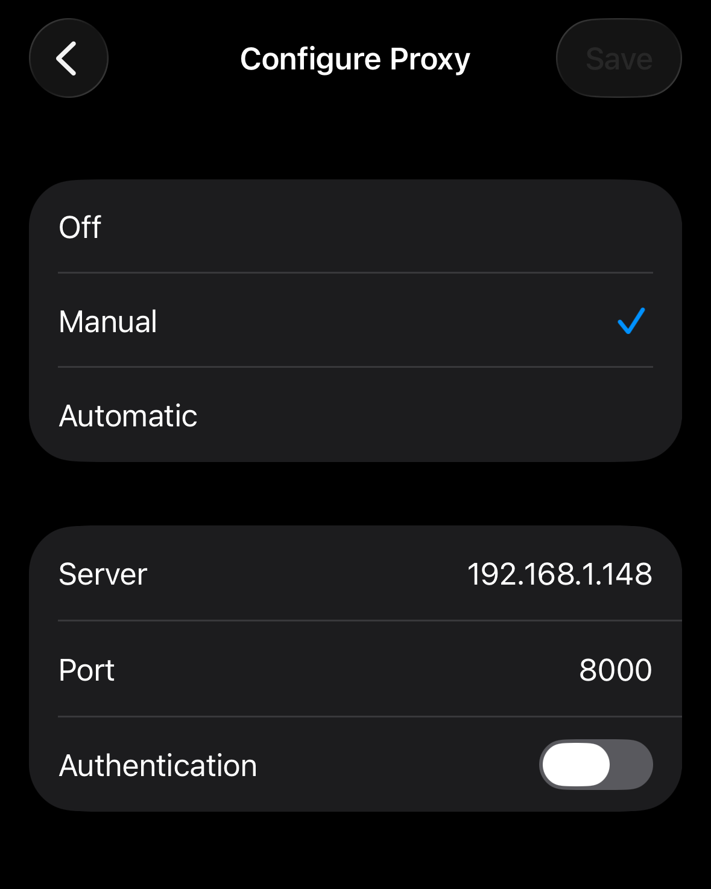

You can find your computer's local IP address and proxy port in HTTP Toolkit.

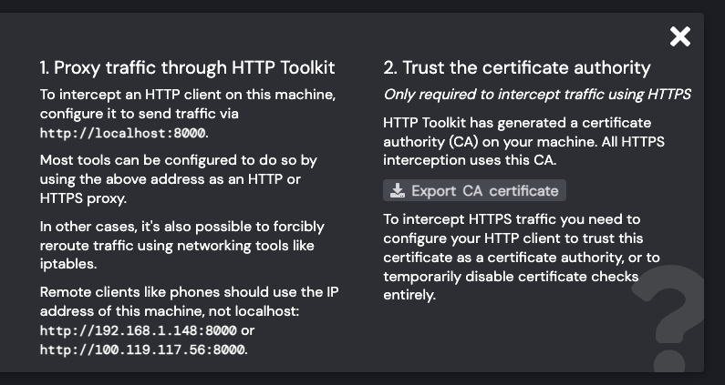

> [!TIP]
> If multiple IP addresses are shown, use your computer's **local network IP address** (typically `192.168.x.x` or `10.x.x.x`) when configuring your iPhone.


---

# Install the HTTP Toolkit Certificate

In HTTP Toolkit, click **Export CA Certificate**.

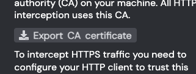

Save the certificate to your computer.

Transfer the certificate to your iPhone. AirDrop is recommended.

After the certificate has been transferred, open the **Settings** app.

Tap **Profile Downloaded**.

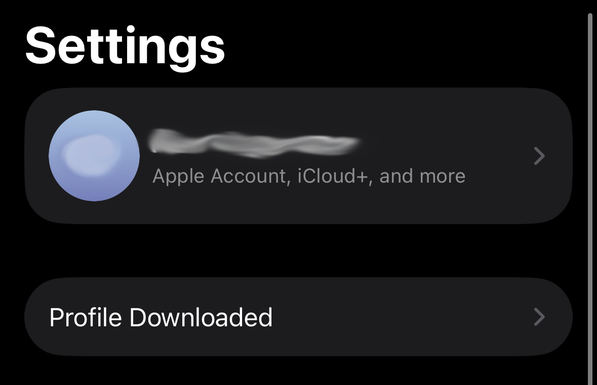

Tap **Install**.

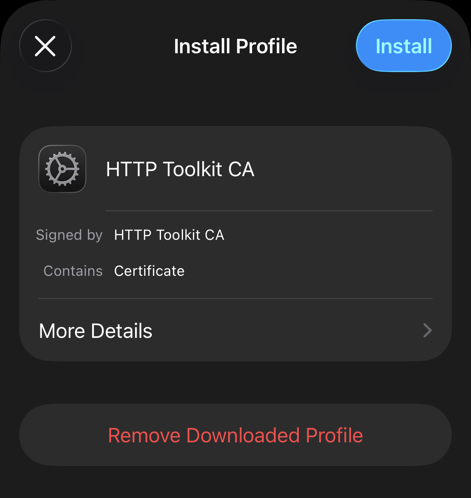

After the installation is complete, enable certificate trust:

```text
Settings
→ General
→ About
→ Certificate Trust Settings
```

Enable Full Trust for:

```text
HTTP Toolkit CA
```

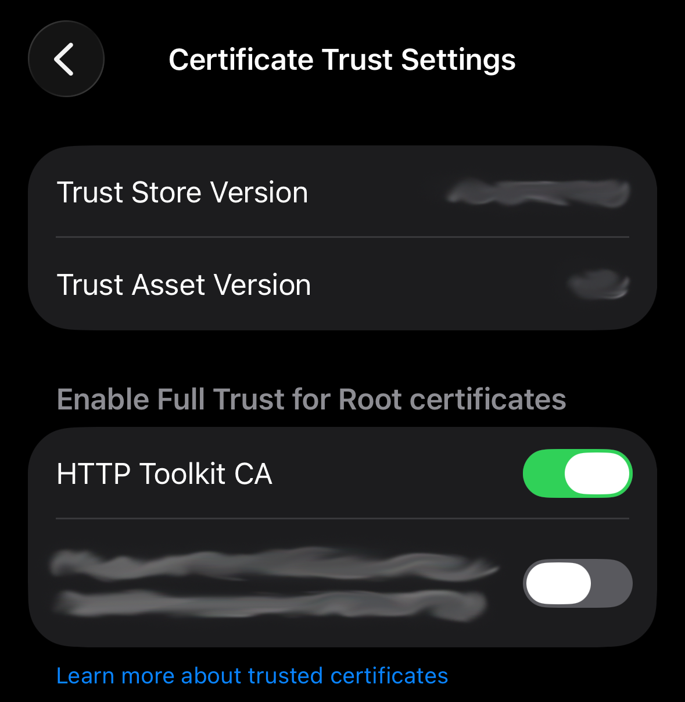

> [!IMPORTANT]
> HTTPS traffic will not be visible until the certificate is trusted.

---

# Generate a New Login Session

Open the official KUNI application.

1. Log out of your account.
2. Log back in.

This generates the authentication requests required to retrieve your credentials.

You should now see new requests appearing in HTTP Toolkit.

The following sections explain where to find each required credential.

---

# Retrieve Your Credentials

Return to HTTP Toolkit.

All required values can now be copied from the captured requests.

---

## Client ID

Find and open:

```text
POST /oauth2/token
```

Navigate to:

```text
Request
→ Body
```

Copy the value of:

```text
client_id
```

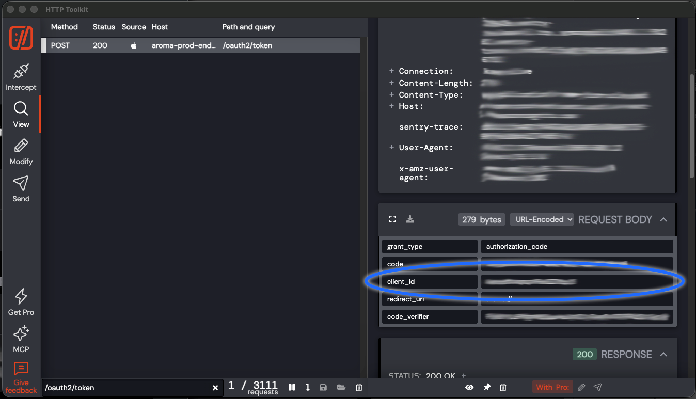

---

## Refresh Token

Open the same request:

```text
POST /oauth2/token
```

Navigate to:

```text
Response
→ Body
```

Copy the value of:

```text
refresh_token
```

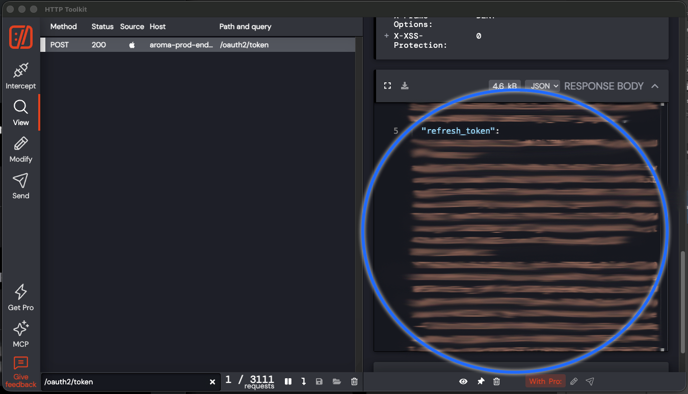

---

## Organization ID

Open any authenticated KUNI API request made after logging in.

Navigate to:

```text
Request
→ Headers
```

Copy the value of:

```text
Organization-ID
```

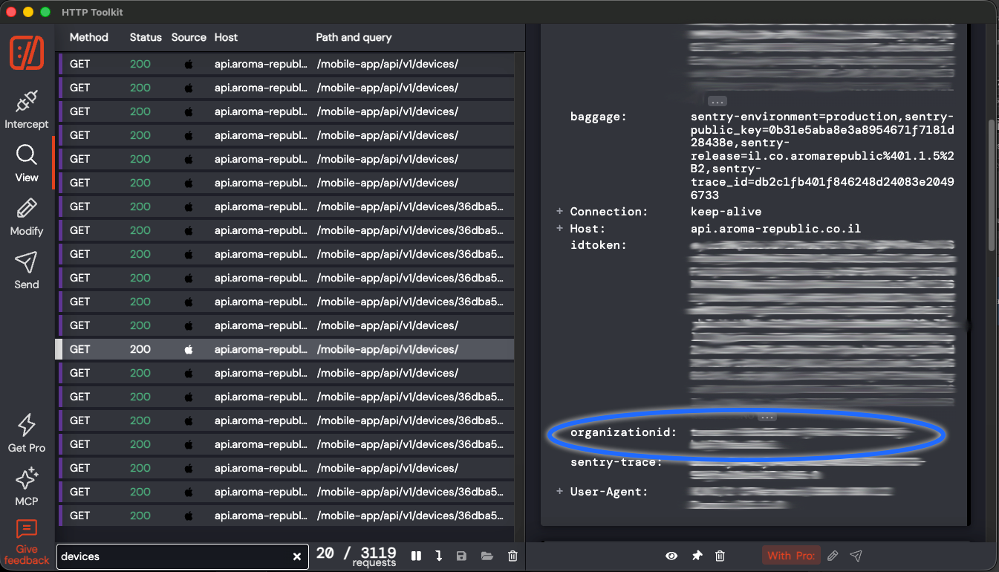

---

## Device ID

Open a request that returns your diffuser information, such as:

```text
GET /mobile-app/api/v1/devices/
```

Navigate to:

```text
Response
→ Body
```

Locate your diffuser.

Copy the value of the top-level:

```text
id
```

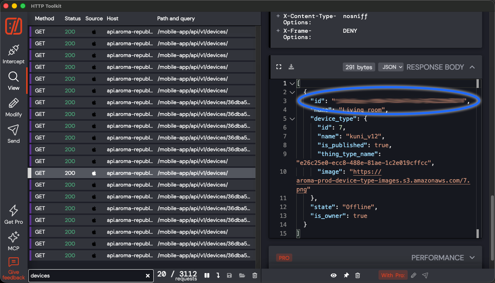

Example:

```json
{
  "id": "xxxxxxxx-xxxx-xxxx-xxxx-xxxxxxxxxxxx",
  "name": "Living Room",
  "device_type": {
    "id": 7
  }
}
```

> [!IMPORTANT]
> Copy the top-level device **id**.
>
> Do **not** copy `device_type.id`.

---

# Configure Home Assistant

Open Home Assistant.

Navigate to:

```text
Settings
→ Devices & Services
→ Add Integration
→ KUNI Diffuser
```

Paste the following values:

- Client ID
- Refresh Token
- Organization ID
- Device ID

Click **Submit**.

If the credentials are valid, your KUNI diffuser will be added to Home Assistant.

---

# Troubleshooting

## No Internet Connection on iPhone

Check the following:

- Your computer and iPhone are connected to the same Wi-Fi network.
- HTTP Toolkit is still running.
- The proxy server matches your computer's local IP address.
- Authentication is disabled in the iPhone proxy settings.
- The HTTP Toolkit certificate is installed and trusted.

---

## No Requests Appear in HTTP Toolkit

Check the following:

- HTTP Toolkit is running.
- **Anything** interception is active.
- The proxy is enabled on your iPhone.
- Your iPhone is still connected to the same Wi-Fi network as your computer.
- You logged out and back into the KUNI application after enabling the proxy.

---

## HTTPS Requests Cannot Be Read

Check the following:

- The HTTP Toolkit CA profile is installed.
- Full Trust is enabled for **HTTP Toolkit CA** under:

```text
Settings
→ General
→ About
→ Certificate Trust Settings
```

---

## Cannot Find the OAuth Token Request

Use the search field in HTTP Toolkit and search for:

```text
/oauth2/token
```

Then select the request with:

```text
Method: POST
Status: 200
```

---

## Cannot Find the Device ID

Use the search field in HTTP Toolkit and search for:

```text
devices
```

Open a successful `GET` request and inspect its response body.

Use the top-level device `id`, not the `id` nested inside `device_type`.

---

## Setup Completed

The credentials only need to be collected once.

After completing the setup, you can disable the manual proxy on your iPhone:

```text
Settings
→ Wi-Fi
→ ⓘ Your Wi-Fi Network
→ Configure Proxy
→ Off
```

If your refresh token expires or becomes invalid in the future, repeat this guide to obtain a new one.
